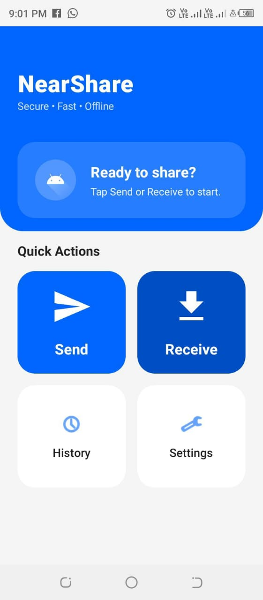
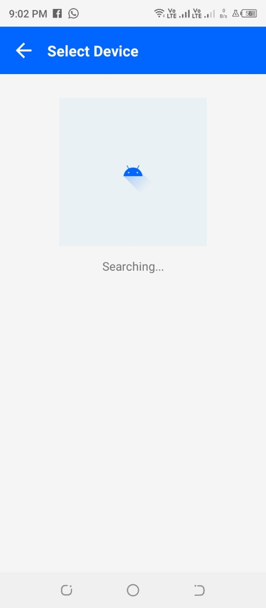
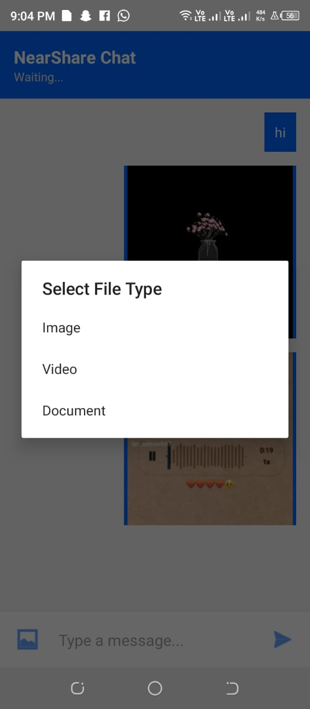

# 📡 NearShare - Offline P2P File Sharing App

> A high-speed, native Android application for sharing files (Images, Videos, Documents) between devices using Wi-Fi Direct. No Internet or Bluetooth required.


## 📱 Project Overview
NearShare is a peer-to-peer (P2P) file-sharing tool designed to solve the problem of slow Bluetooth transfers and data-heavy cloud sharing. It utilizes the **Android Wi-Fi P2P Framework** to establish a direct, high-bandwidth connection between devices, allowing for transfer speeds of up to **10-15 MB/s**.

This project solves critical fragmentation issues in the Android ecosystem, specifically addressing hardware incompatibilities on MediaTek devices (Tecno, Infinix) through custom connection logic.

## ✨ Key Features
* **🚀 Zero Internet Required:** Fully offline transfer using Wi-Fi Direct.
* **⚡ High-Speed Transfer:** Significantly faster than Bluetooth.
* **🖼️ Rich Chat Interface:** Send/Receive Text, Images, Videos, and PDFs in a chat-like view.
* **📸 Smart Previews:**
    * Generates thumbnails for Video files.
    * Displays saved filenames for Documents.
* **💾 Save to Gallery:** Long-press any received media to save it securely to the phone's public storage.
* **🔧 Cross-Device Compatibility:** Custom "Force Client Mode" logic ensures seamless connection between Samsung, Pixel, and Tecno/Infinix devices.

## 📸 Screenshots
|                  Home Screen                  |                  Device Discovery                  |             File Transfer (Chat)              |
|:---------------------------------------------:|:--------------------------------------------------:|:---------------------------------------------:|
|  |  |  |

*(Note: Upload your screenshots to a folder named `screenshots` in your repo and update the names above)*

## 🛠️ Technical Stack
* **Language:** Kotlin, XML
* **Architecture:** MVC / MVVM pattern
* **Networking:** `java.net.Socket`, `ServerSocket`, `WifiP2pManager`
* **Concurrency:** Custom Background Threads & Handlers
* **Storage:** Android Scoped Storage & `FileProvider`
* **UI Components:** `RecyclerView`, `ConstraintLayout`, `ViewBinding`

## 🧠 Technical Highlights (How it Works)

### 1. The Connection Handshake
Unlike standard implementations, NearShare handles "Group Owner" negotiation manually to prevent connection timeouts on specific hardware.
* **Sender** acts as the *Client*.
* **Receiver** acts as the *Host* (Group Owner).
* **WPS Setup** is disabled to force a simpler, more reliable connection method.

### 2. Custom Stream Protocol
To prevent data corruption when mixing Text and Binary (Image/Video) data in a single socket stream, a custom header protocol was implemented:
1.  **Header (Int):** Defines Data Type (`1=Text`, `2=Image`, `3=Video`, `4=Doc`).
2.  **Size (Long):** Defines exact byte length of the payload.
3.  **Payload:** The actual raw bytes.

*This ensures the receiver reads exactly the correct number of bytes, preventing stream desynchronization.*

## 🚀 Installation & Setup
1.  **Clone the Repo:**
    ```bash
    git clone [https://github.com/YourUsername/NearShare.git](https://github.com/YourUsername/NearShare.git)
    ```
2.  **Open in Android Studio:**
    * File -> Open -> Select the cloned folder.
3.  **Build Project:**
    * Wait for Gradle Sync to finish.
4.  **Run:**
    * Connect two physical Android devices via USB debugging.
    * Install the app on both.
    * Grant **Location** and **Nearby Devices** permissions.

## 🔮 Future Enhancements
* [ ] End-to-End Encryption (AES-256) for secure transfers.
* [ ] QR Code scanning for instant connection.
* [ ] Resume interrupted transfers.
* [ ] Desktop Companion App.

## 📄 License
This project is licensed under the MIT License - see the [LICENSE](LICENSE) file for details.

---
**Developed by Bilal Nazeer**